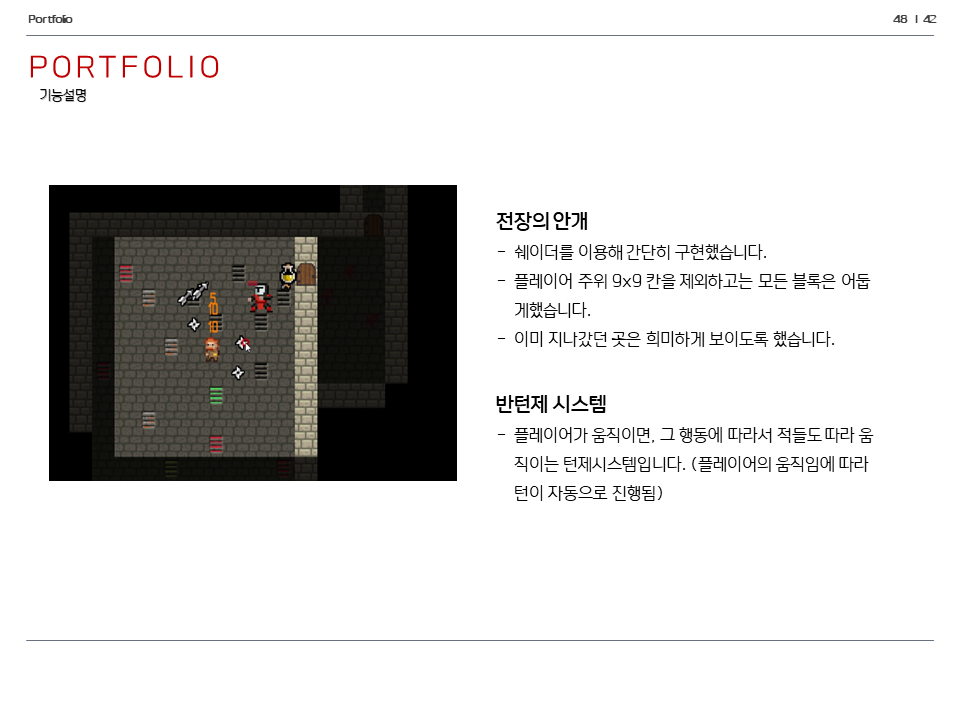
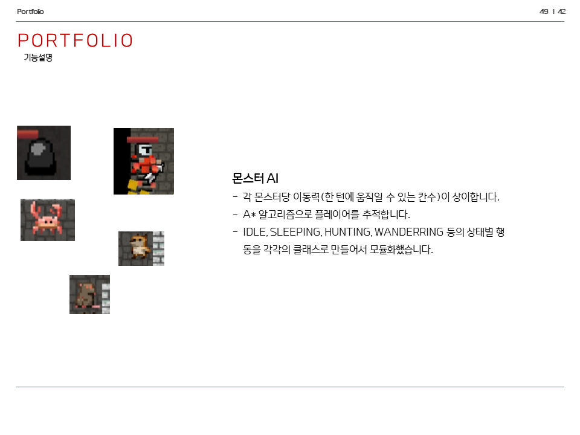
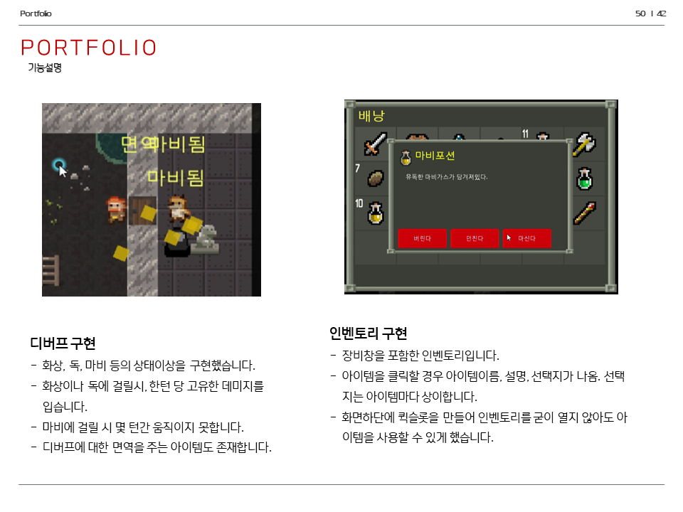
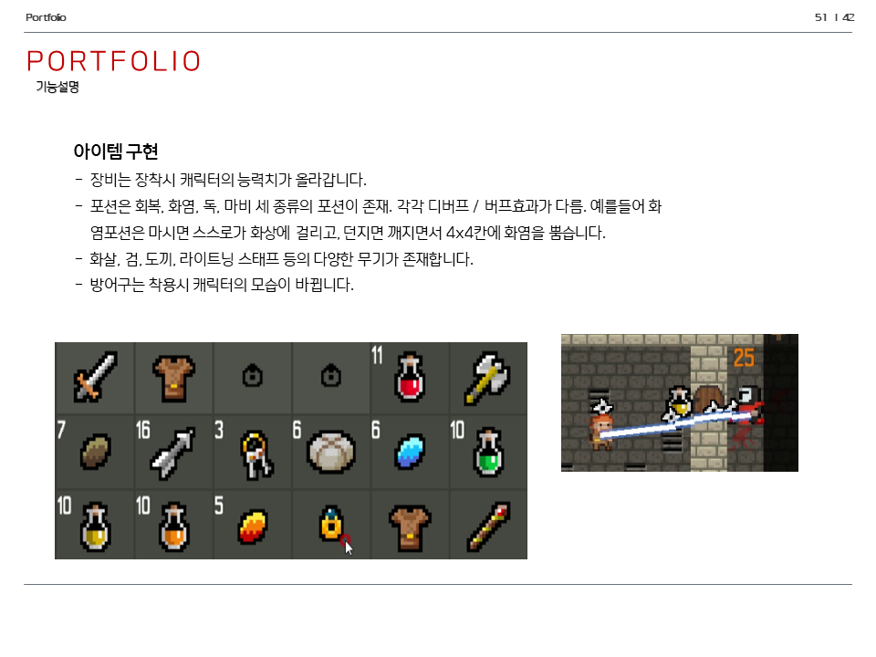
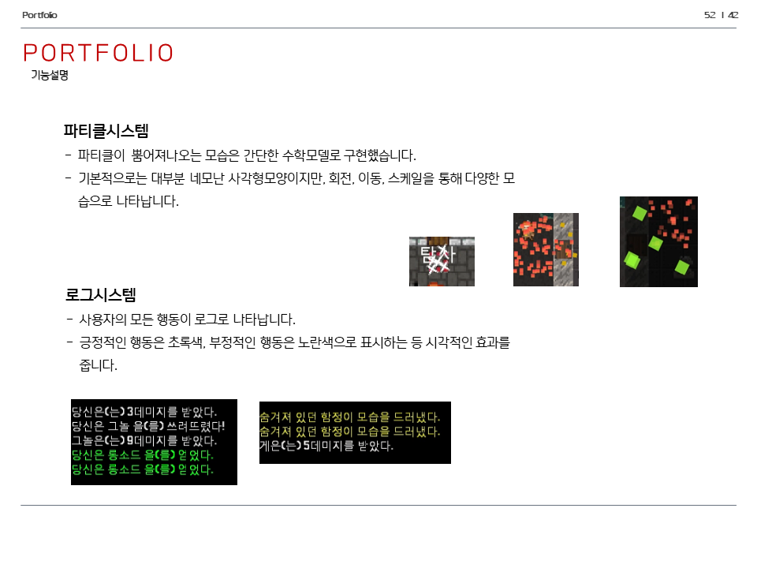

# 픽셀던전 클론
게임 <픽셀던전>의 모작입니다.


## 사용기술
C++, DirectX9, MFC, WIN32API


## 실행법
```
# 깃 허브에서 소스코드를 다운로드 받습니다.
git clone https://github.com/bsw112/anime_worldcup.git

# DirectX9을 설치합니다.

# MyGame\Default\MyGame.vcxproj 파일로 프로젝트를 엽니다.

#비주얼 스튜디오로 빌드합니다. 개발환경은 비주얼스튜디오 2016 버전입니다.
솔루션 탐색기 > MyGame > 프로젝트 속성 > VC++디렉터리 > 포함디렉터리에 $(ProjectDir)../Headers 경로를 추가합니다.
솔루션 탐색기 > MyGame > 프로젝트 속성 > HLSL 컴파일러 > 셰이더형식을 효과(/fx) 로 맞춰줍니다.
솔루션 탐색기 > MyGame > 프로젝트 속성 > HLSL 컴파일러 > 셰이더모델을 Shader Model2(/2.0) 으로 맞춰줍니다.
솔루션 탐색기 > MyGame > 프로젝트 속성 > 링커 > 입력 > 추가 종속성에서 d3d9.lib, d3dx9.lib 를 추가해줍니다. 
솔루션 탐색기 > MyGame > 빌드를 통해 빌드합니다.

```


## 주요기능
* 전장의 안개
* 반턴제 시스템
* A* 길찾기 알고리즘
* 다양한 아이템
* 버프, 디버프 구현
* 몬스터 AI
* 로그 시스템


## 실제화면






## 시연
[](https://www.youtube.com/watch?v=tCYWEeGaZ8A&t=119s)
